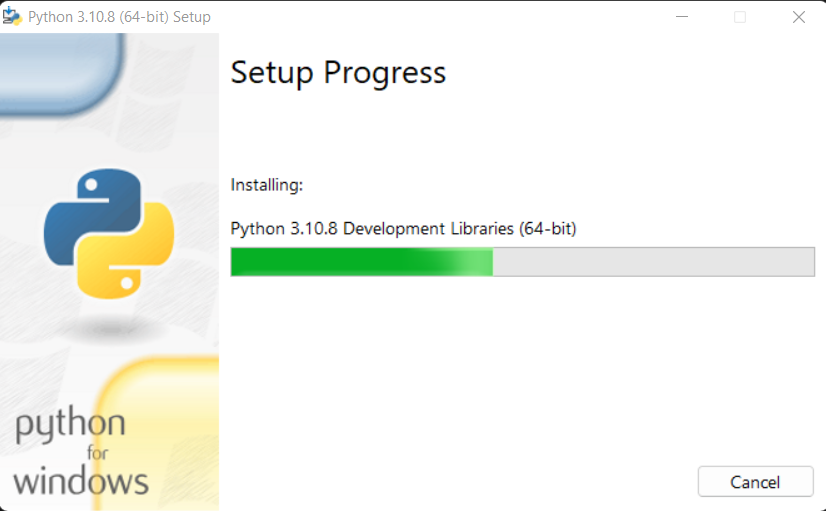

# Langkah langkah instalasi python
Python sebagai bahasa pemrograman yang harus dikuasai, merupakan salah satu skill teknis yang wajib kamu miliki. Langkah pertama yang tepat untuk mempelajari skill tersebut adalah dengan menginstall python di PC kamu. Tentunya ada beberapa metode atau cara untuk melakukan instalasi python, tapi sebelum itu kamu perlu mendownload python terlebih dahulu. Dengan mendownload dan menginstall python di PC kamu tentunya proses learning by doing kamu akan berjalan dengan tepat, sehingga ketika kamu telah memahami teori kamu juga bisa langsung mempraktekkannya. Kamu juga tidak perlu khawatir, karena python support untuk berbagai sistem operasi seperti Windows, Linux/Unix, macOS, bahkan iOS juga. 

Yuk mari kita belajar bersama cara menginstalasi Aplikasi Python

**1 . Cara Download Python di Semua Sistem Operasi**

Untuk mendownload python di semua OS, Windows, Linux kamu membutuhkan space memori sekitar 25 MB di PC kamu.Ketika di instal, python memerlukan sekitar 90 MB space memori. Cara mendownloadnya adalah cukup dengan cara sederhana dibawah ini:

* Kunjungi www.python.org
* Kamu bisa download python versi terbaru. Saat ini versi terbaru python adalah Python 3.10.8. Secara otomatis akan menyesuaikan dengan OS yang kamu gunakan saat ini. Atau kamu juga bisa memilih ingin mendownload installer untuk windows, linux, atau macOS secara manual.
* Jika kamu memilih mendownload otomatis maka akan langsung terdownload file python-3.10.8-amd64.exe di PC atau laptop kamu.
* Jika kamu memilih mendownload secara manual dengan memilih terlebih dahulu OS kamu, maka tampilannya akan seperti ini:

* kamu bisa memilih ingin mendownload python sesuai dengan kebutuhan kamu dan OS yang kamu gunakan.
* Dan kamu hanya perlu menunggu proses download python selesai.

**2 . Cara Setting Up Python di Windows**

Setelah mendownload installer python selanjutnya kamu perlu menginstall python di windows. Jika, kamu pengguna windows berikut adalah cara install python:

* Double click file python-3.10.8-amd64.exe yang telah kamu download tadi, hingga muncul popup seperti gambar dibawah

pastikan bahwa install launcher for all users (recommended) dan add python 3.10.8 to path tercentang. dan klik Install Now. Namun, jika installer python mendeteksi versi python telah terinstall maka yang akan muncul adala Upgrade Now.
* Saat kamu menjalankannya, maka akan muncul popup User account control, yang pesannya seperti ini Do you want to allow this app to make changes to your device. Maka selanjutnya kamu klik Yes button untuk melanjutkan proses instalasi. Seperti gambar dibawah ini

* Setelah instalasi selesai maka akan muncul popup dibawah ini

* Keika penginstalan telah selesai dicek keaplikasi.Dan apabila python berhasil terinstall maka tampilannya sebagai berikut:

